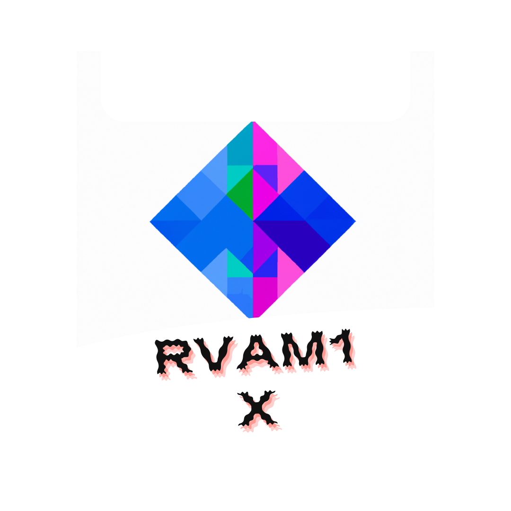

# RVAMsr X1.0

█▀▀▀▀▀▀▀▀▀▀▀▀▀▀▀▀▀▀▀▀█
█░░╦─╦╔╗╦─╔╗╔╗╔╦╗╔╗░░█
█░░║║║╠─║─║─║║║║║╠─░░█
█░░╚╩╝╚╝╚╝╚╝╚╝╩─╩╚╝░░█
█▄▄▄▄▄▄▄▄▄▄▄▄▄▄▄▄▄▄▄▄█

AI Engine - RVAMSRX
Welcome to the AI Engine - RVAM1X, your gateway to the future of Artificial Intelligence.

Overview
RVAM1X is a cutting-edge AI engine developed by NSC that opens the door to limitless possibilities in the realm of artificial intelligence. With a focus on efficiency, scalability, and security, this engine empowers developers to create intelligent applications that stand out in a world driven by data and automation.

Features
Efficiency: RVAM1X is designed to streamline the development of AI applications, making it easier and faster to harness the power of AI in your projects.

Scalability: Whether you're working on small-scale AI applications or large-scale, data-intensive projects, RVAM1X scales with your needs.

Security: Trust is paramount in AI applications, and RVAM1X prioritizes data security, ensuring the protection of sensitive information.

Adaptability: From natural language processing to computer vision and predictive analytics, RVAMSRX adapts to various AI domains and use cases.

Getting Started
To get started with RVAMSRX, follow these simple steps:

Installation: Check out our installation guide in the Installation Documentation.

Usage: Explore the User Guide to understand how to leverage RVAMSR 1.0X in your AI projects.

Examples: Browse the Examples directory for sample code and projects that demonstrate RVAMSRX's capabilities.

Documentation
For in-depth information about RVAM1X, consult the full documentation.

Contribute
We welcome contributions from the AI community. If you'd like to contribute to RVAMsr 1.0 X's development, please refer to our Contribution Guidelines.

Support
For questions, issues, or general inquiries, feel free to reach out to our support team at support@rvam1x.ai.

License
RVAM1X is released under the MIT License, allowing you to use and modify it for both open-source and commercial projects.

Dive into the future of AI with RVAM1X. Get started today, and let your AI ambitions soar.

Please ensure that you replace the placeholder links (e.g., /docs/installation.md) with the actual links to your documentation and relevant resources. This README provides an introduction to your AI engine and guides users on how to get started with it.

